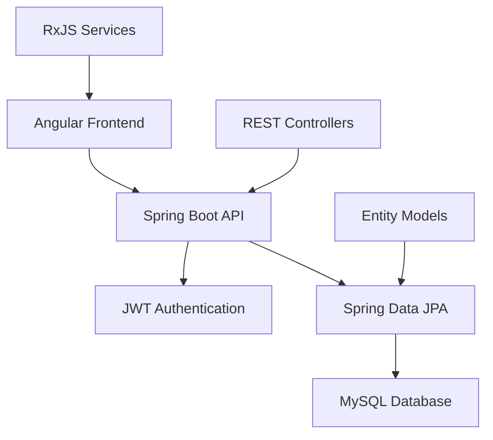

# 🚀 Sistema de Inventario - Full Stack Application

> *"Sistema completo de gestión de inventario con arquitectura microservicios, API RESTful y dashboard interactivo"*

## 🌟 Características Principales

### 📦 Gestión de Inventario
- ✅ **CRUD completo** de productos y categorías
- 📊 **Dashboard analytics** con métricas en tiempo real
- 🔍 **Búsqueda avanzada** y filtros dinámicos
- 📈 **Reportes automáticos** de stock y rotación
- 🏷️ **Gestión de categorías** y subcategorías

### 🔐 Sistema de Seguridad
- 👤 **Autenticación JWT** con roles de usuario
- 🛡️ **Autorización por endpoints** 
- 🔒 **Password encryption** con BCrypt
- 📧 **Sistema de recuperación** de contraseñas

## 🏗️ Arquitectura del Sistema

