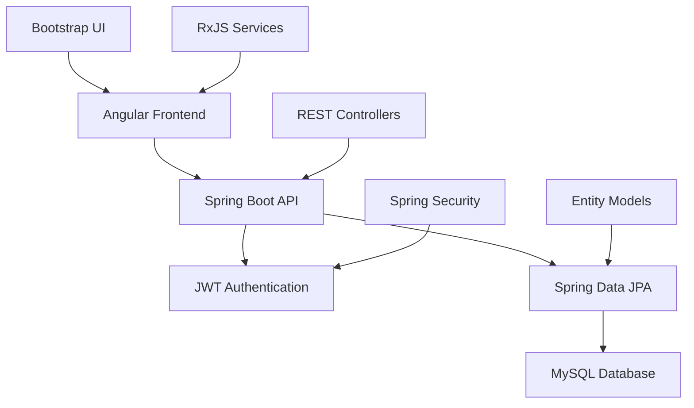
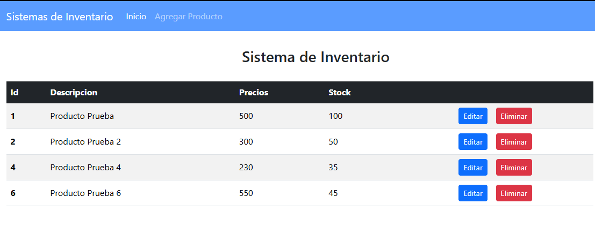
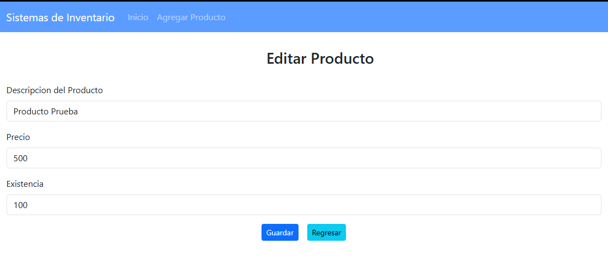
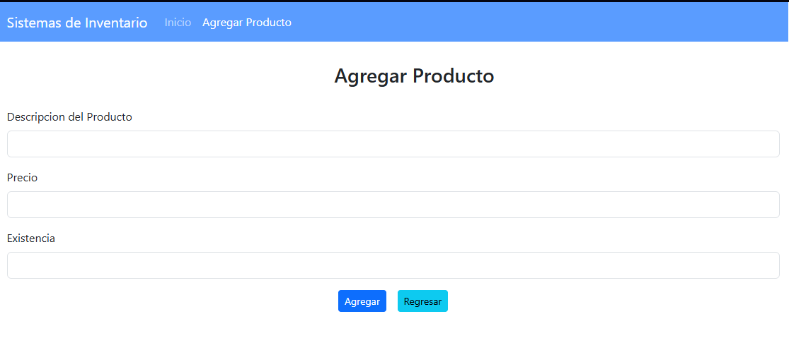
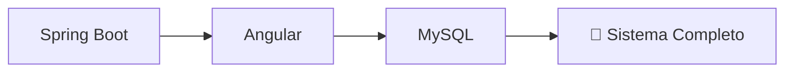

# 🚀 Sistema de Inventario - Full Stack Application


> *"Sistema completo de gestión de inventario con arquitectura microservicios, API RESTful y dashboard interactivo"*

---

## 🌟 Características Principales

### 📦 Gestión de Inventario
- ✅ **CRUD completo** de productos y categorías
- 📊 **Dashboard analytics** con métricas en tiempo real
- 🔍 **Búsqueda avanzada** y filtros dinámicos
- 📈 **Reportes automáticos** de stock y rotación
- 🏷️ **Gestión de categorías** y subcategorías

### 🔐 Sistema de Seguridad
- 👤 **Autenticación JWT** con roles de usuario
- 🛡️ **Autorización por endpoints** 
- 🔒 **Password encryption** con BCrypt
- 📧 **Sistema de recuperación** de contraseñas

### 🎨 Experiencia de Usuario
- 📱 **Diseño responsive** con Bootstrap
- ⚡ **Interfaz moderna** y intuitiva
- 🔄 **Actualizaciones en tiempo real**
- 🎯 **Navegación fluida** entre módulos

---

## 🏗️ Arquitectura del Sistema



---

## 📸 **Capturas del Sistema**

### 🏠 **Vista Principal - Lista de Productos**
| **Descripción** | **Vista** |
|-----------------|-----------|
| **Dashboard principal** con tabla de productos existentes en el sistema | <div align="center"><br/>*Tabla de productos con ID, descripción, precios y stock*</div> |

### ✏️ **Editor de Productos**
| **Descripción** | **Vista** |
|-----------------|-----------|
| **Formulario de edición** para modificar productos existentes con campos de descripción, precio y existencia | <div align="center"><br/>*Interfaz de edición con datos pre-cargados*</div> |

### ➕ **Agregar Nuevo Producto**
| **Descripción** | **Vista** |
|-----------------|-----------|
| **Formulario de creación** para agregar nuevos productos al inventario | <div align="center"><br/>*Formulario limpio para nuevo registro*</div> |

---

## 🛠️ Tecnologías Utilizadas

### 🔧 Backend
- **Spring Boot 3.0** - Framework de aplicaciones Java
- **Spring Security** - Autenticación y autorización
- **Spring Data JPA** - Persistencia de datos
- **JWT** - Tokens de autenticación
- **Maven** - Gestión de dependencias

### 🎨 Frontend
- **Angular 16** - Framework TypeScript
- **Bootstrap 5** - Framework CSS
- **RxJS** - Programación reactiva
- **TypeScript** - Superset de JavaScript

### 🗄️ Base de Datos
- **MySQL 8.0** - Base de datos relacional

---

## 🚀 Instalación Rápida

```bash
# Clonar repositorio
git clone https://github.com/Astharmin/Sistema_Inv.git
cd Sistema_Inv

# Backend (Spring Boot)
cd backend
mvn spring-boot:run

# Frontend (Angular)
cd ../frontend
npm install
ng serve
```

---

## 📁 Estructura del Proyecto

```
SysInv_Angular/
├── backend/                 # 🖥️ Spring Boot Application
│   ├── src/
│   │   ├── main/java/
│   │   │   ├── controller/     # 🎮 REST Controllers
│   │   │   ├── service/        # ⚙️ Business Logic
│   │   │   ├── repository/     # 🗄️ Data Access Layer
│   │   │   ├── entity/         # 📊 JPA Entities
│   │   │   └── config/         # 🔧 Security Config
│   │   └── resources/
│   └── pom.xml
├── frontend/                # 🎨 Angular Application
│   ├── src/
│   │   ├── app/
│   │   │   ├── components/     # 🧩 UI Components
│   │   │   ├── services/       # 🔌 HTTP Services
│   │   │   ├── models/         # 📝 TypeScript Interfaces
│   │   │   └── guards/         # 🛡️ Route Guards
│   └── package.json
├── captures/                # 📸 Capturas del sistema
│   ├── image.png           # Vista principal
│   ├── image_2.png         # Editor de productos
│   └── image_3.png         # Agregar producto
└── README.md
```

---

## 🔌 Endpoints Principales

### 🔐 Autenticación
```http
POST /api/auth/login     # Inicio de sesión
POST /api/auth/register  # Registro de usuario
```

### 📦 Gestión de Productos
```http
GET    /api/products     # Listar productos
POST   /api/products     # Crear producto
PUT    /api/products/{id} # Actualizar producto
DELETE /api/products/{id} # Eliminar producto
```

### 📊 Reportes
```http
GET /api/reports/stock   # Reporte de stock
GET /api/reports/sales   # Reporte de ventas
```

---

## 📊 **Funcionalidades Demostradas**

### ✅ **Operaciones CRUD Completas**
- **📋 Listar productos** con tabla responsive
- **➕ Agregar nuevos productos** con validación
- **✏️ Editar productos existentes** con datos pre-cargados
- **🗑️ Eliminar productos** con confirmación

### 🎯 **Interfaz Intuitiva**
- **Navegación fluida** entre módulos
- **Formularios responsive** con Bootstrap
- **Feedback visual** inmediato
- **Manejo de estados** de carga y error

---

## 📄 Licencia

Este proyecto está bajo la Licencia MIT. Consulta el archivo [LICENSE](LICENSE) para más detalles.

---

<div align="center">

### ⭐ ¿Te gustó este proyecto? ¡Déjame una estrella en GitHub!

**Desarrollado con ❤️ por [Astharmin](https://github.com/Astharmin)**


